# [北理爬虫mooc](https://www.bilibili.com/watchlater/#/av9784617/p1)


- [[北理爬虫mooc](https://www.bilibili.com/watchlater/#/av9784617/p1)]  
- [第一周](#第一周)        
    - [Requests库网络爬取实战](#requests库网络爬取实战)   
- [第二周](#第二周)        
    - [Beautiful Soup 库](#beautiful-soup-库)        
    - [信息的标记](#信息的标记)      
    - [实例：大学排名爬取](./02_第二周/04_大学排名爬取.py)
- [第三周](#第三周)        
    - [正则表达式(regular expression)](#正则表达式(regular-expression))
## 第一周
### Requests库网络爬取实战
- 实例一：京东商品页面爬取
- 实例二：亚马逊商品页面的爬取
    ```python
  import requests
  url = "https://www.amazon.com/dp/B01FJS2MXU/"
  try:
      kv = {'user-agent': 'Mozilla/5.0'}
      r = requests.get(url, headers=kv)
      r.raise_for_status()
      r.encoding = r.apparent_encoding
      print(r.text[1000:2000])
      with open("amazon.html", "w", encoding="utf-8") as f:
         f.write(r.text)
  except:
      print("爬取失败")
    ```
- 实例三：百度/360搜索关键字提交
  ```python
  # 百度
  import requests
  url = "http://www.baidu.com/s"
  try:
      kw = {'wd': 'Python'}
      kv = {'user-agent': 'Mozilla/5.0'}
      r = requests.get(url, params=kw, headers=kv)
      r.raise_for_status()
      r.encoding = r.apparent_encoding
      print(r.text[1000:2000])
      with open("baidu1.html", "w", encoding="utf-8") as f:
          f.write(r.text)
  except:
      print("爬取失败")
   ```
  ```python
  # 360
  import requests
  url = "https://m.so.com/s"
  try:
      kw = {"q": "Python"}
      kv = {"user-agent": "Mozilla/5.0"}
      r = requests.get(url, params=kw, headers=kv)
      r.raise_for_status()
      r.encoding = r.apparent_encoding
      print(r.text[:2000])
      with open("360search.html", "w", encoding="utf-8") as f:
          f.write(r.text)
  except:
      print("爬取失败")
  ```
- 实例四：网络图片的爬取和存储
  ```python
  import requests
  import os
  root = "./pic/"
  url = "https://i0.hdslb.com/bfs/article/7d5ae1cba5b668982a28cf5db8e84ca94ab84ae8.jpg@1320w_1860h.webp"
  path = root + "0{}.jpeg"  # url.split('/')[-1]
  
  try:
      if not os.path.exists(root):
          os.mkdir(root)
      if not os.path.exists(path):
          r = requests.get(url)
          print(r.status_code)
  
          with open(path.format("b"), 'wb') as f:
              f.write(r.content)
              f.close()
              print("文件保存成功")
      else:
          print("文件已存在")
  except:
      print("爬取失败")
  ```
- 实例五：IP地址归属地的自动查询
  ```python
  import requests
  url = "http://m.ip138.com/ip.asp?ip="
  ip = "202.204.80.112"   # 北理官网ip
  try:
      r = requests.get(url+ip)
      r.raise_for_status()
      r.encoding = r.apparent_encoding
      print(r.text[-500:])
  except:
      print("爬取失败")
  ```

## 第二周

### Beautiful Soup 库
- [Beautiful Soup官网](https://www.crummy.com/software/BeautifulSoup/)
- pip install beatifulsoup4
  ```python
  from bs4 import BeautifulSoup
  soup = BeautifulSoup("<html>data<html>","html.parser")
  soup = BeautifulSoup(open("D:/demo.html"),"html.parser")  
  ```
- Beautiful Soup类
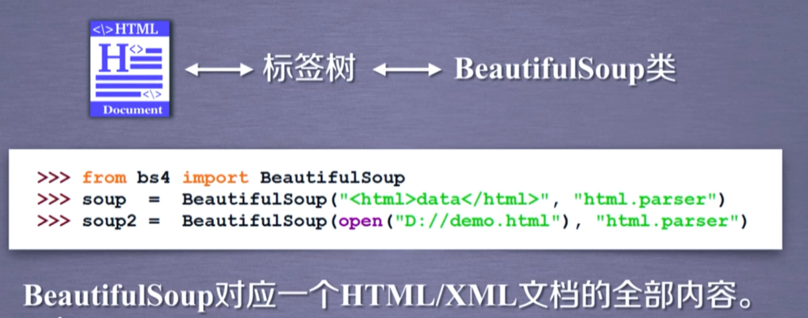

- Beautiful Soup库是 __解析、遍历、维护“标签树”__ 的功能库。
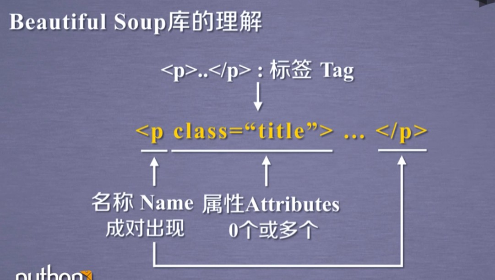
- 引用方式
  - `from bs4 import BeautifulSoup` 调用函数时使用
  - `import bs4` 用来判断变量类型时使用 eg:`isinstance(tr, bs4.element.Tag)`
- Beautiful Soop库解析器
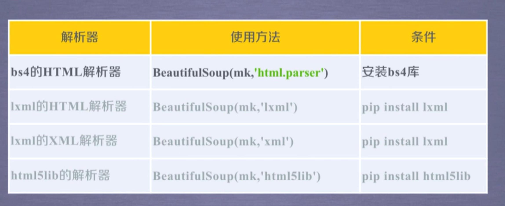
- Beautiful Soup类的基本元素
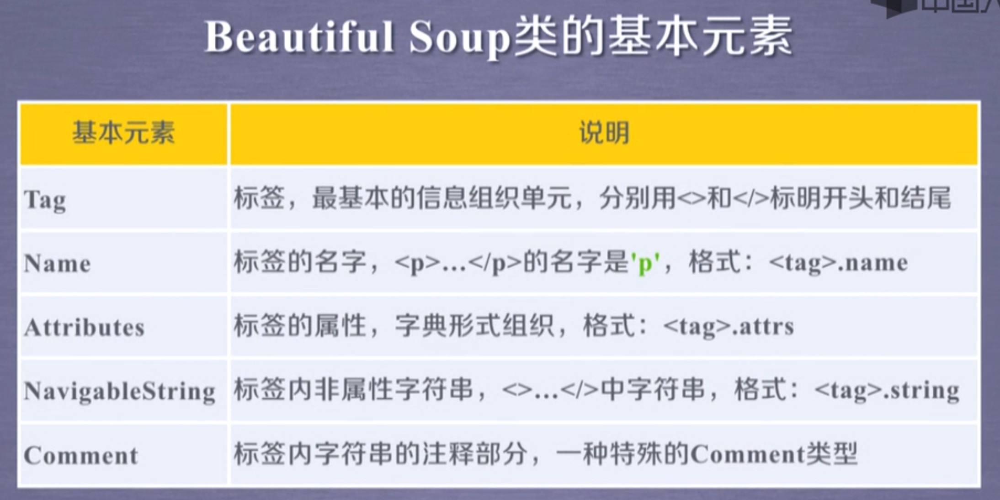
- Beautiful Soup类的基本理解
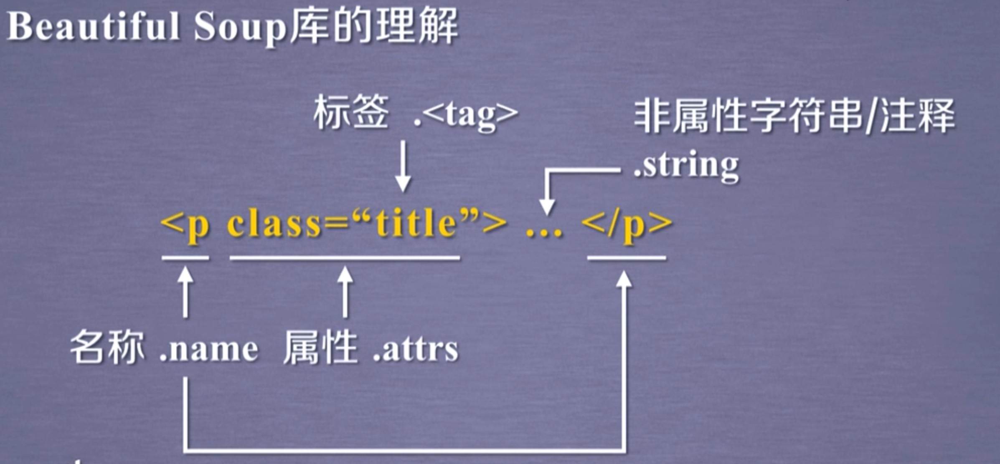
- 标签树的三种遍历

  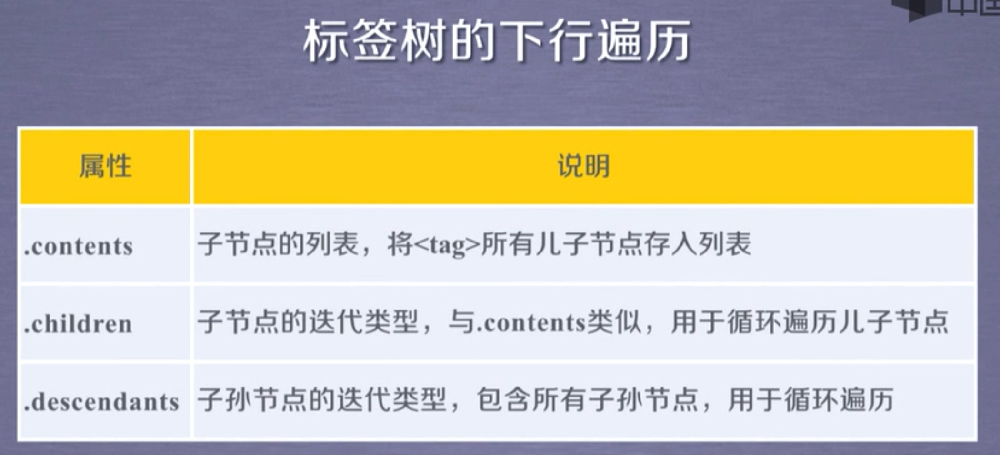
  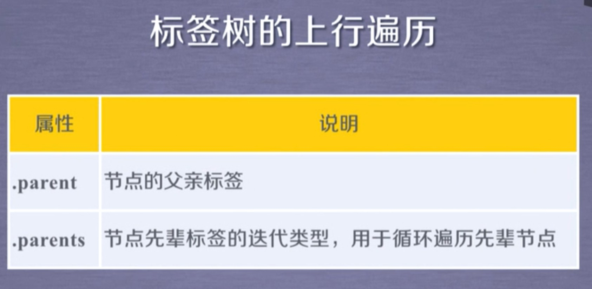
  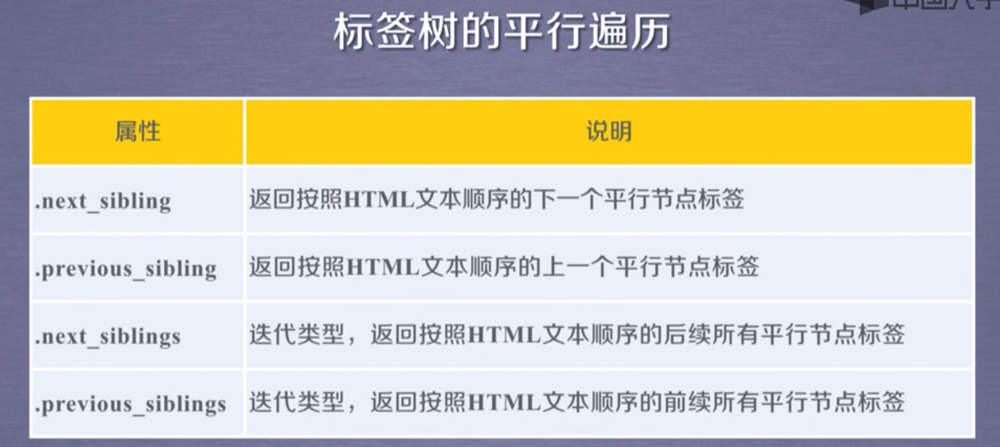
  - [标签树的遍历样例代码](./02_第二周/02_标签树的遍历.py)    
    ```python
    '''下行遍历'''
    # 父节点二
    print(soup.body)
    print(soup.body.contents)   # 子节点
    print(len(soup.body.contents))  # 子节点的数量
    print(soup.body.contents[0])  # 第一个子节点
    # 遍历儿子节点
    for child in soup.body.children:
        print(child)
    # 遍历子孙节点
    for child in soup.body.children:
        print(child)

    '''上行遍历'''
    print(soup.title.parent)
    print(soup.html.parent)  # html的父亲是自身
    print(soup.parent)  # soup本身的父亲是None
    # 遍历父亲节点
    for parent in soup.a.parents:   # 父亲、爷爷、曾祖父.....
        if parent is None:
            print(parent)   # 因为一定会遍历到soup的本身，这个时候它父亲是None，所以打印本身
        else:
            print(parent.name)

    '''平行遍历   有条件:平行遍历发生在同一父节点下的各节点间'''
    print(soup.a.next_sibling)  # a标签的下一个节点
    # 打印出 'and' 说明各个节点间的平行遍历的结果不一定是标签类型，还可能是<class 'bs4.element.NavigableString'>，平行遍历时，需要分情况讨论
    print(type(soup.a.next_sibling))
    print(soup.a.previous_sibling)  # a表示的前一个节点
    # 遍历后续节点
    for sibling in soup.a.next_siblings:
        print(sibling)
    # 遍历前续节点
    for sibling in soup.a.previous_siblings:
        print(sibling)
    ```
- 打印友好的html文本: `print(soup.prettify())`

- __基于bs4库的HTML内容查找方法__
    - `<>.find_all()`
      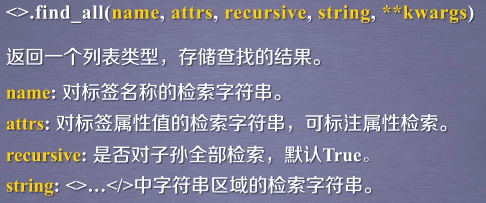
      __tips：__  
      `<>.find_all() 等价于 <>()`  
      `soup.find_all() 等价于 soup()`
      ```python
      # 打印文档中标签为'a'的
      print(soup.find_all('a'))
      print(soup.find_all(['a', 'b']))
      # 打印文档中所有标签名称
      for tag in soup.find_all(True):
          print(tag.name)
      # 打印文档中带有'course'属性的p标签
      print(soup.find_all('p', 'course'))
      # 打印文档中属性 id='link1'的元素
      print(soup.find_all(id='link1'))
      print(soup.find_all(id='link'))
      # 使用正则表达式查找
      print(soup.find_all(id=re.compile('link')))

      '''对比是否查找子孙'''
      # 因为a标签是soup下的孙子，所以找不到
      print(soup.find_all('a'))
      print(soup.find_all('a', recursive=False))
      # 因为html标签是soup下的儿子，所以可以找到
      print(soup.find_all('html', recursive=False))

      # 查找字符串
      print(soup.find_all(string='Basic Python'))     # 完全匹配
      print(soup.find_all(string=re.compile('python')))  # 正则表达式匹配
      ```
    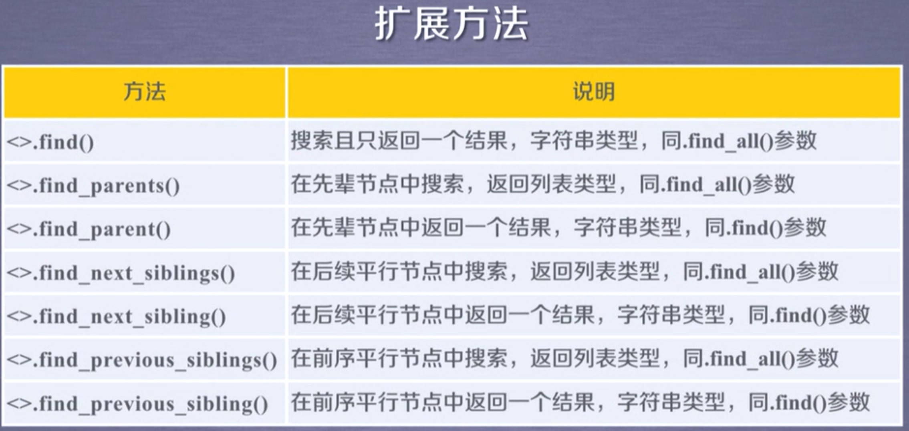

- 总结：BeautifulSoup库入门
  - bs4库的基本元素
    - Tag
    - Name
    - Attributes
    - NavigableString
    - Comment
  - bs4库的遍历功能
    - 下行遍历
        - .contents
        - .children
        - .descendants
    - 上行遍历
        - .parent
        - .parents
    - 平行遍历
        - .next_sibling
        - .previous_sibling
        - .next_siblings
        - .previous_siblings

### 信息的标记
- 信息标记的三种方式
    - xml (eXtensible Markup Language)
    - json (JavaScript Object Notation)
    - ymal (YAML Ain;t Markup Language)
- xml
    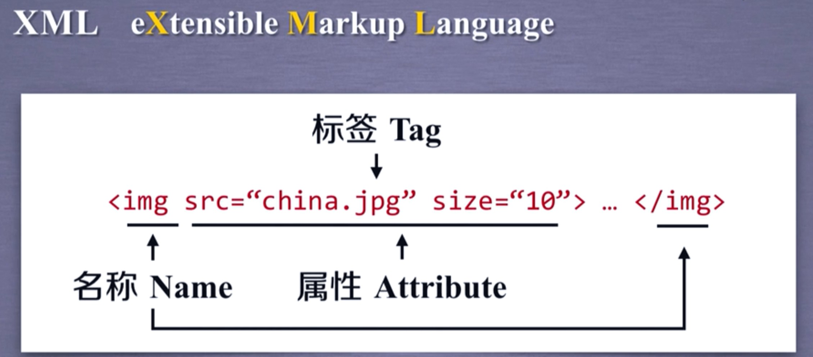
    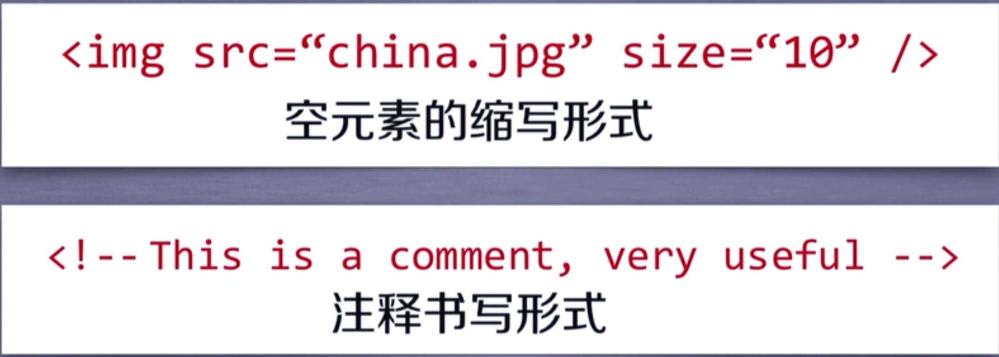
- json 
    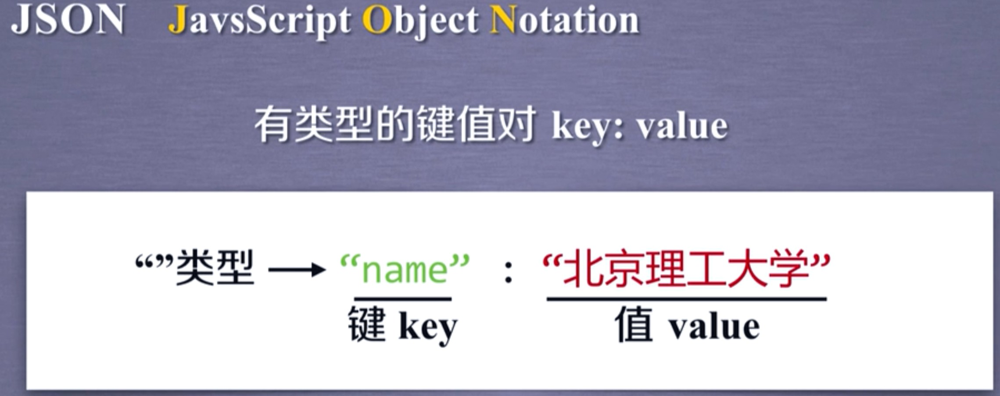
    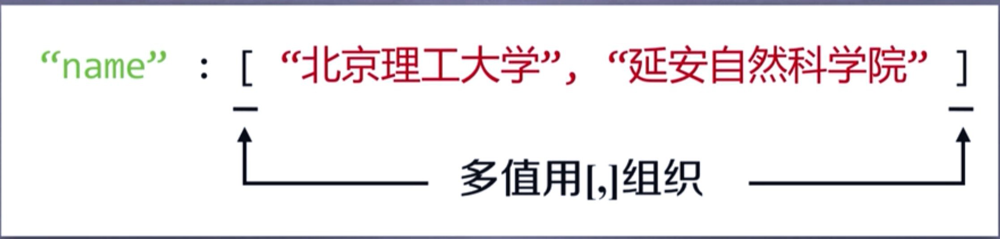
    
    ```json
    "key" : "value" 
    "key" : ["value1","value2"]
    "key" : {"subkey" : "subvalue"}
    ```
- yaml
    - 无类型键值对  key：value
    ```YAML
    name : 
            newName : 北京理工大学
            oldName : 延安自然科学院
    # 使用 - 表达并列关系
    name : -北京理工大学
           -延安自然科学院
    # 使用 | 表达整块数据
    # 学校介绍
    text : | 
    北京理工大学的前身是延安自然科学院，是中国共产党创办的第一所理工科大学，毛泽东同志亲自题写校名。emmmm还可以打很多字
    ```
- 三种信息标记形式的比较
    - xml：最早的通用信息标记语言，可扩展性好，但繁琐。用于Internet上的信息交互与传递。
    - json：信息有类型，适合程序处理（js）,较xml简洁。用于移动应用云端和节点的信息通信，无注释。
    - yaml：信息无类型，文本信息比例最高，可读性好。用于各类系统的配置文件，有注释易读。
- __信息提取的方法__
    - 法一：完整解析信息的标记形式，再提取关键信息。
        - 需要标记解析器 例如：bs4库的标签树遍历
        - 优点：信息解析准确
        - 缺点：提取过程繁琐，速度慢
    - 法二：无视标记形式，直接搜索关键信息。
        - 对信息的文本调用查找函数即可    
        - 优点：提取过程简洁，速度较快。
        - 提取结果准确性与信息内容相关。
    - 常用：混和使用以上两种方法。
        - 实例：提取HTML中所有URL链接
            -  思路：            
                1. 搜索到所有\<a>标签。
                2. 解析\<a>标签格式，提取href后的链接内容。
      ```python
      soup = BeautifulSoup(demo, "html.parser")
      for link in soup.find_all('a'):
          print(link.get('href'))
      ```

### [实例：大学排名爬取](./02_第二周/04_大学排名爬取.py)
- 补充知识：格式化输出   `“”.format()`
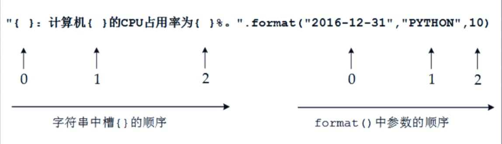
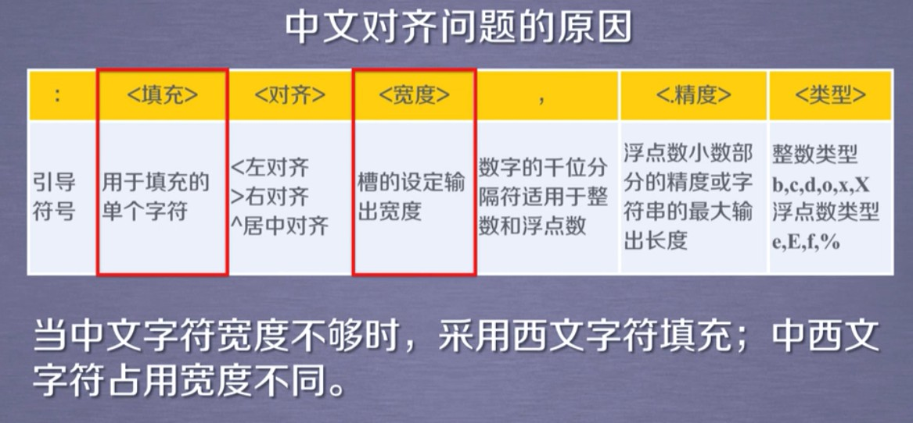
    - 中文空格 chr(12288)
    
## 第三周
### 正则表达式(regular expression)   
- regex==>RE
- 正则表达式是用来简洁表达一组字符串的表达式
  ```
  PN
  PYN               正则表达式:
  PYTN      <==>    P(Y|YT|YTH|YTHO)?N
  PYTHN
  PYTHON
  ```
  ```
  PY
  PYY               正则表达式:
  PYYY      <==>    PY+
  .....
  PYYYY...
  ```
  ```
  'PY' 开头
  后续存在不多于10个字符           正则表达式:
  后续字符不能是'P'or'Y'   <==>    PY[^PY]{0,10}
  eg:'PYABC'
  ```
- 正则表达式的使用
  - 编译：将符合正则表达式语法的字符串转换成正则表达式特征
  ```
  PN               正则表达式:
  PYN       <==>    P(Y|YT|YTH|YTHO)?N       
  PYTN              regex='P(Y|YT|YTH|YTHO)?N'
  PYTHN                 ⬇编译
  PYTHON    <==> 特征: p=re.compile(regex)
  ```
- 正则表达式的语法
  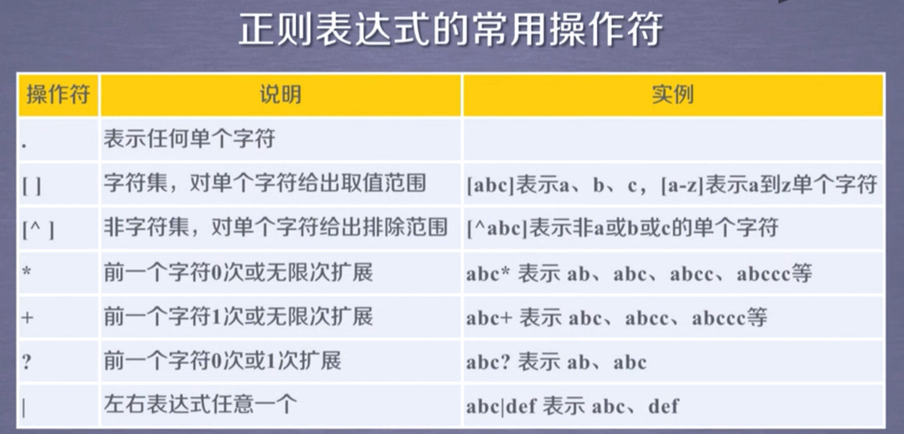
  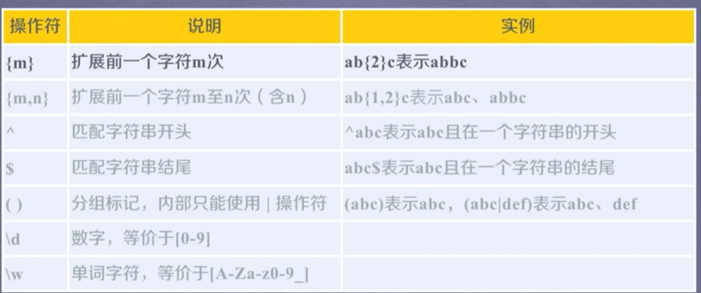
- 正则表达式语法实例  

    name    |正则表达式        | 对应字符串
    -       | :-:             |:-:
    1 | P(Y\|YT\|YTH\|YTHO)?N | 'PY'、'PYN'、'PYTN'...
    2 | PYTHON+               | 'PYTHON'、'PYTHONN'、'PYTHONNN'...
    3 | PY[TH]ON              | 'PYTON'、'PYHON'
    4 | PY[^TH]ON             | 'PYON'、'PYaON'、'PYbON'、'PYcON'...
    5 | PY{:3}N               | 'PN'、'PYN'、'PYYN'、'PYYYN'
  - 经典正则表达式实列
    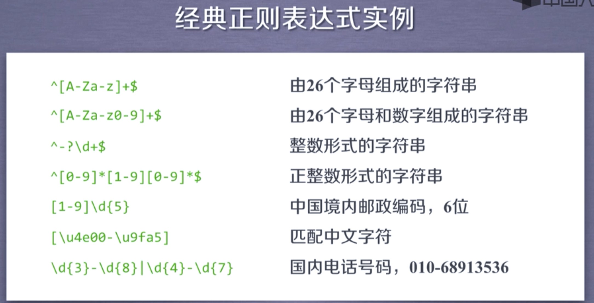
  - 匹配IP地址的正则表达式
    - 分四段，每段0-255
    - 精确写法  
        ```
        0-99    :   [1-9]?\d  
        100-199 :   1\d{2}
        200-249 :   2[0-4]\d
        250-255 :   25[0-5]
        
        IP地址的正则表达式为：
        (([1-9]?\d|1\d{2}|2[0-4]\d|25[0-5]).){3}([1-9]?\d|1\d{2}|2[0-4]\d|25[0-5])
        ```
    - 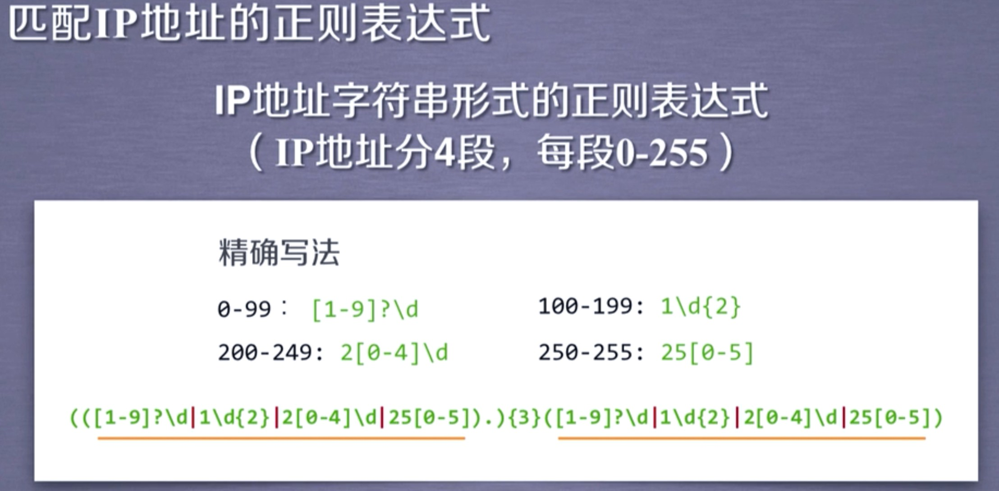
- RE库：Re库是Python的标准库，主要用于字符串匹配。
  - 调用方式：`import re`
  - 正则表达式的表示类型
    - raw string类型（原生字符串类型:指不包含转义符的字符串）  
      re库采用raw string类型表示正则表达式，表示为`r'text'`
      eg:`r'[1-9]\d{5}`  
        `r'\d{3}-\d{8}|\d{4}-\d{7}`
    - string类型（带转义符）
  - Re库的主要功能函数
  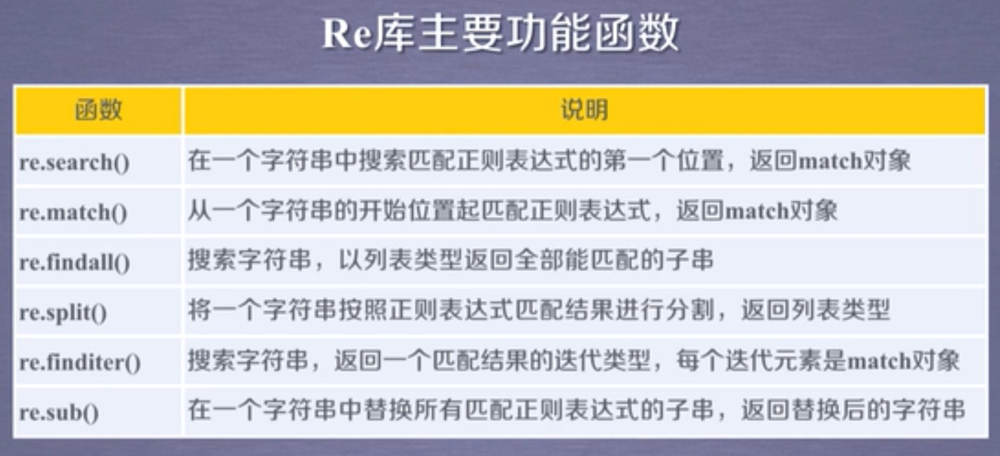
    - re.search()
    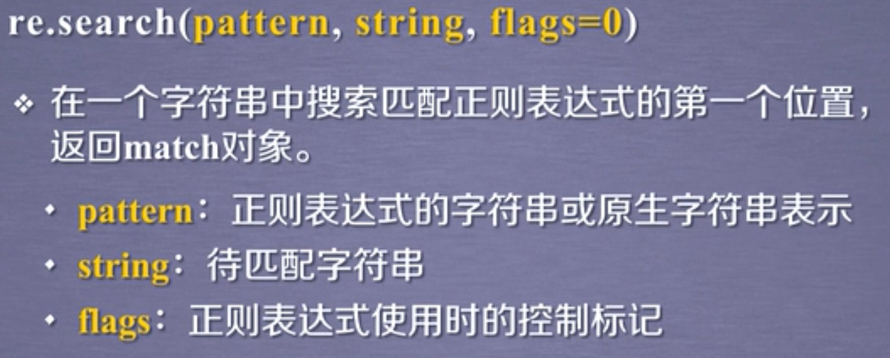
    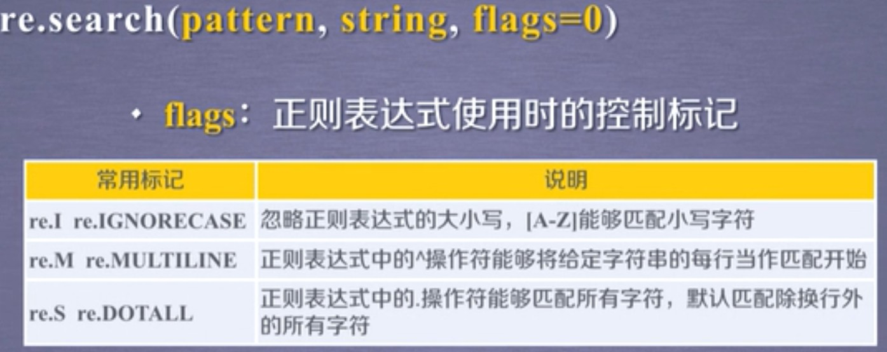
    - re.findall()
    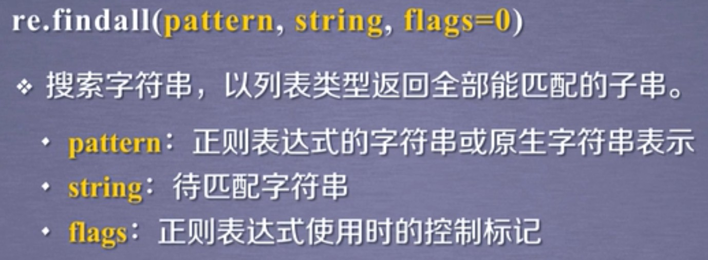
    - re.split()
    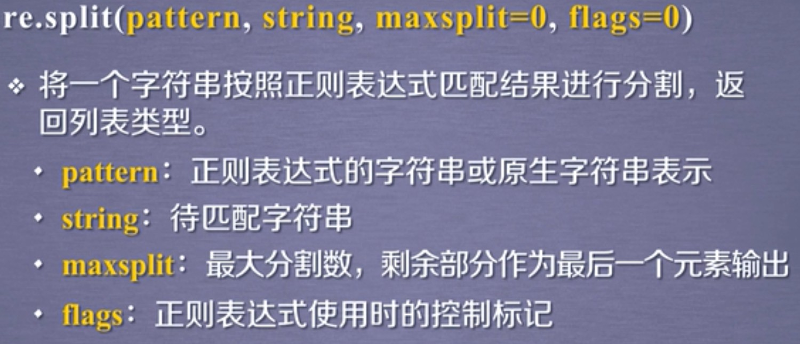
    - re.finditer()
    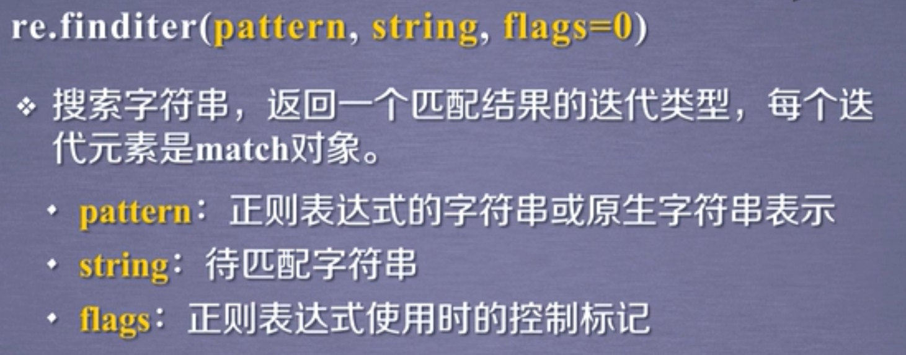
    - re.sub()
    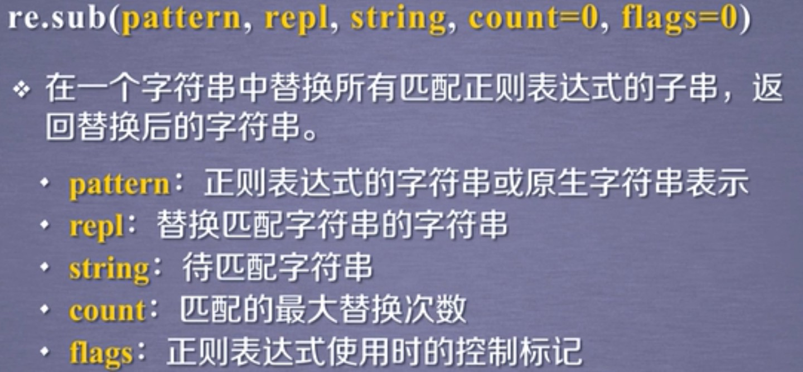
    
  - Re库面向对象函数
    - re.compile()  
    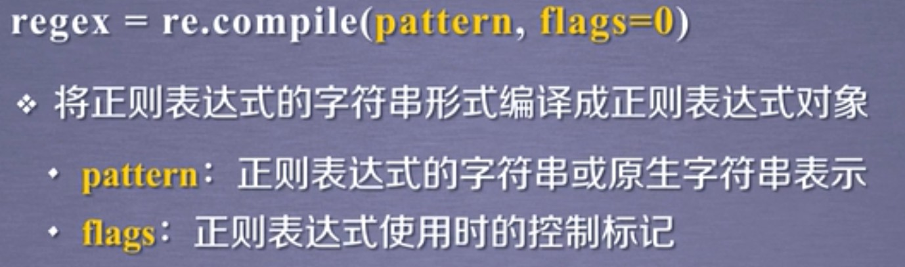
    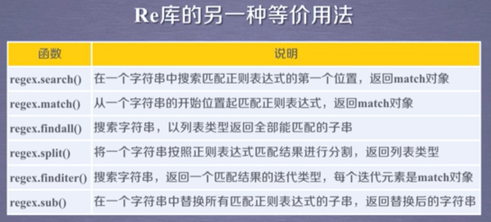
  - Re库的使用方法
    - 函数式用法：一次性操作  
    `rst = re.search(r'[1-9]\d{5}', 'BIT 100081')`
    - 面向对象用法：编译后多次操作  
    `pat = re.compile(r'[1-9]\d{5}')`    
    `rst = pat.search('BIT 100081')`  
    [实例练习](./03_第三周/01_正则表达式练习.py)
  - Re库match对象
    - match对象的属性
    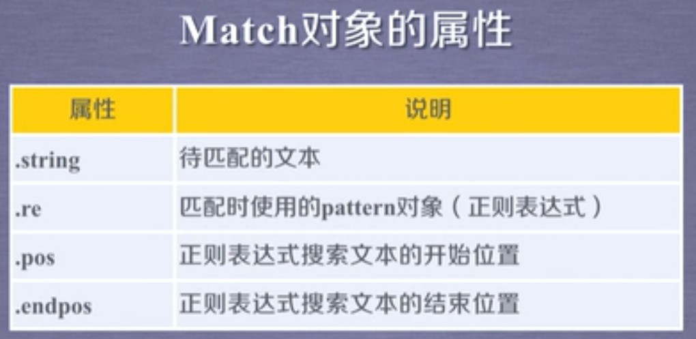
    - match对象的方法
    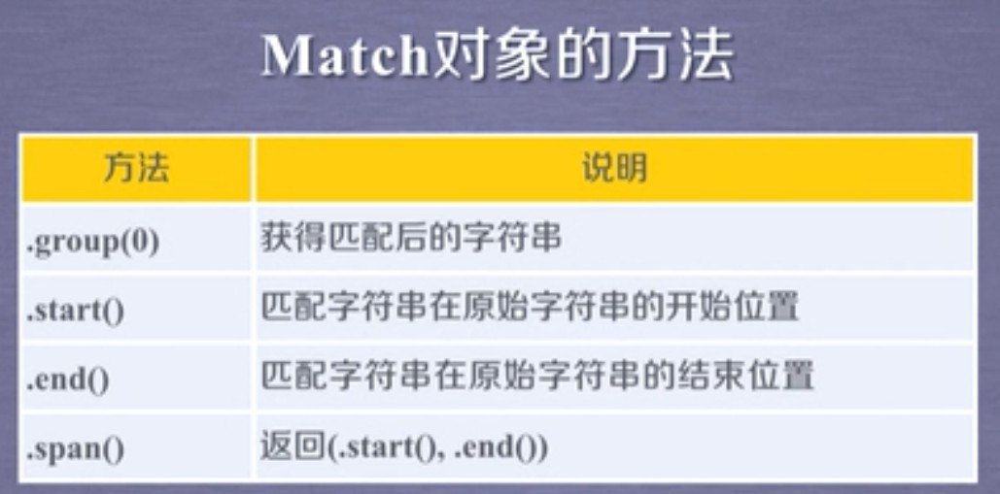
  - 贪婪匹配
   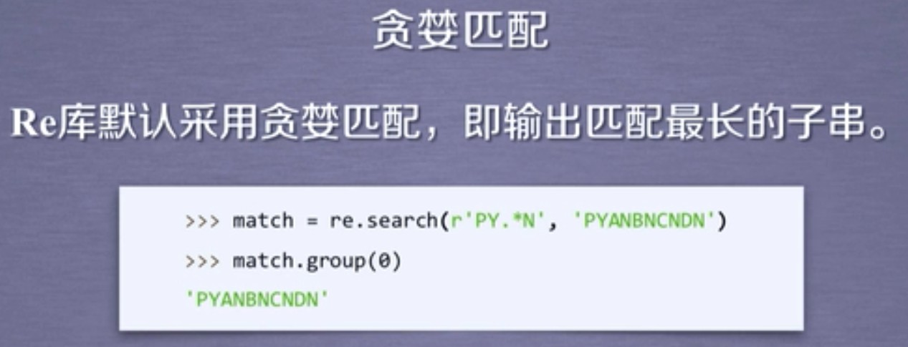
   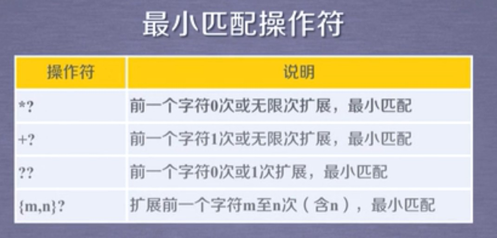
- 小结：
  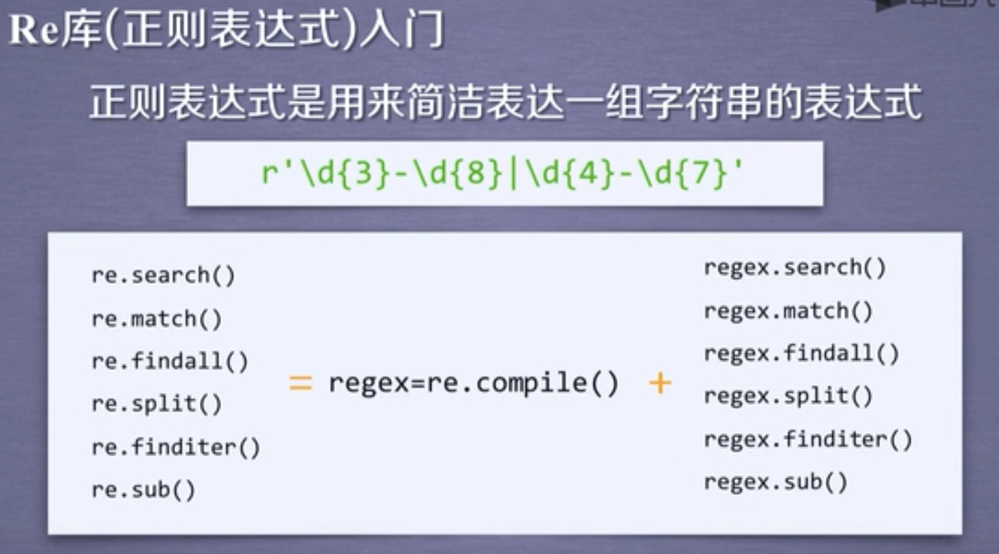
### [商城商品爬取实例](./03_第三周/02_商品爬取.py)
- 定向爬虫
  - 采用requests-re路线实现了商品信息的定向爬虫
  - 熟练掌握正则表达式在信息提取方面的应用
### [股票数据定向爬虫实例]
- 功能描述
  - 目标：获取上交所和深交所所有的股票名称和交易信息
  - 输出：保存到文件中
  - 技术路线：requests-bs4-re
- 候选数据网站的选择
  - 选取原则：股票信息静态保存在HTML页面中，非js代码生成，没有Robots协议限制。
  - 选取方法：浏览器F12，源代码查看等。
  - 选取心态：不要纠结于某个网站，多找信息源尝试。
- 程序的结构设计
  1. 从[东方财富网](http://quote.eastmoney.com/stock_list.html)获取股票列表
  2. 根据股票列表逐个到[百度股票](https://gupiao.baidu.com/)获取个股信息
  3. 将结果存储到文件中 
- 